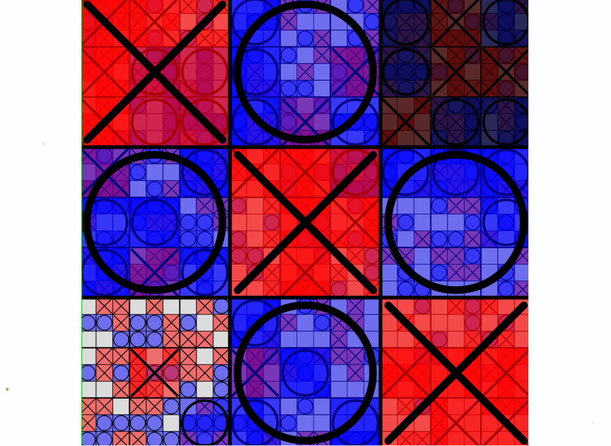
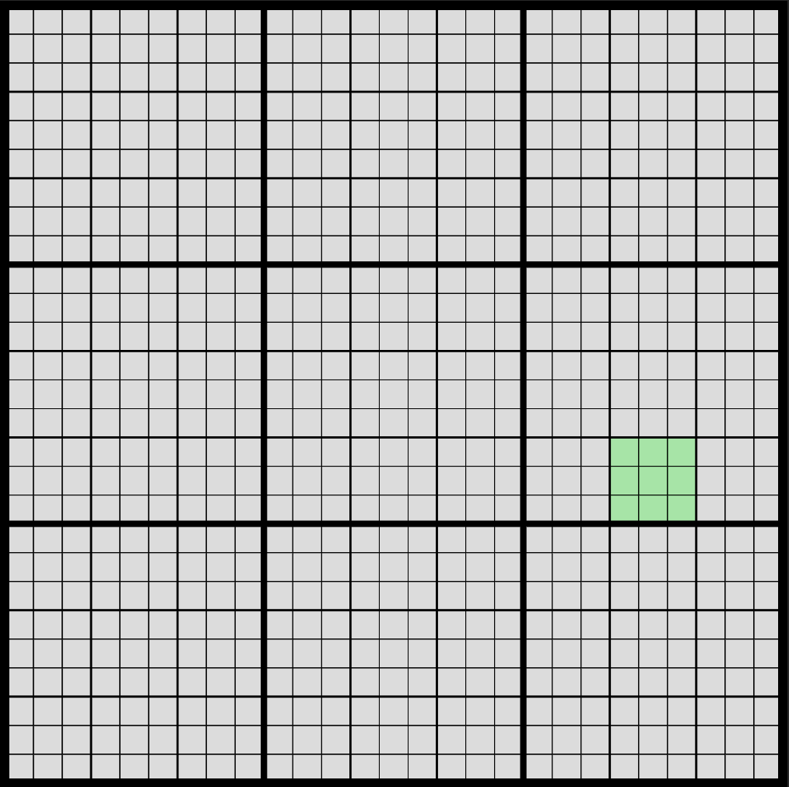
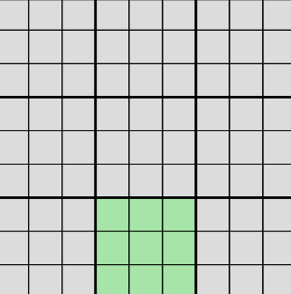
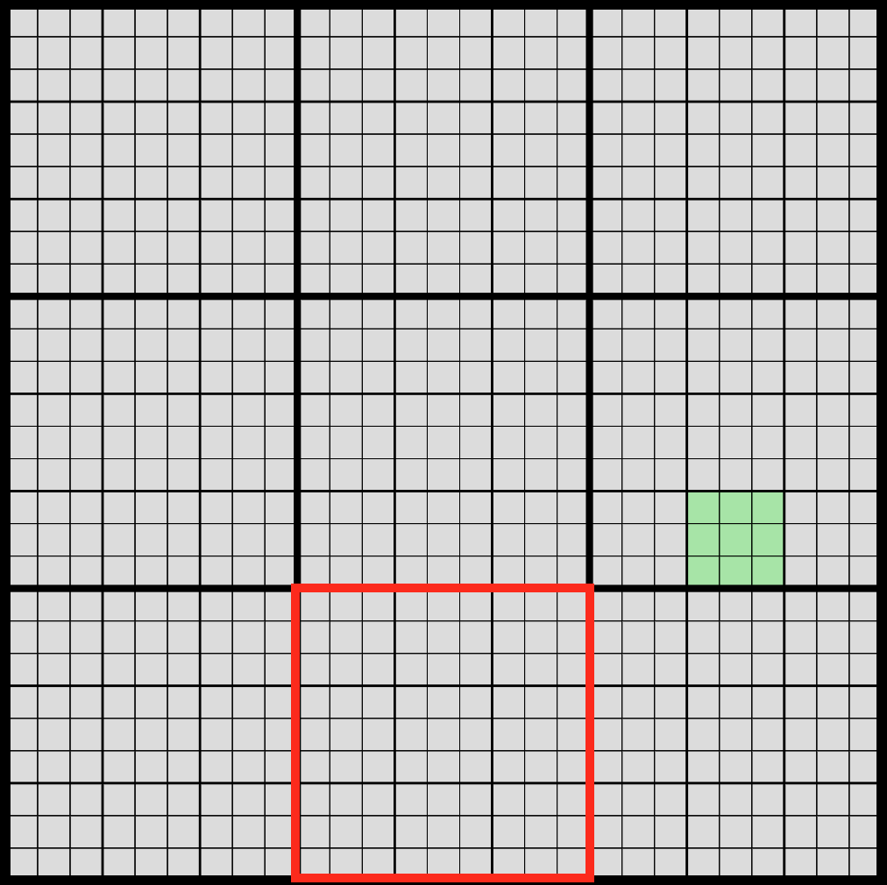
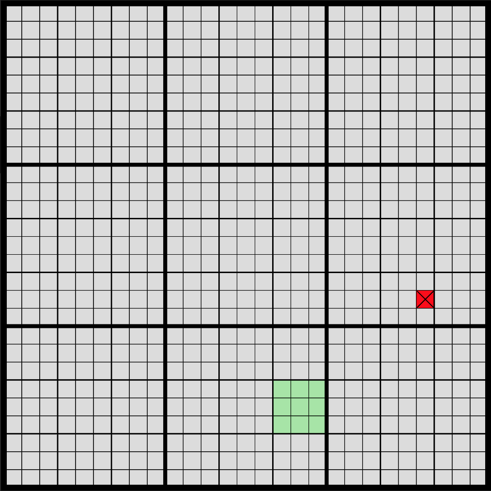
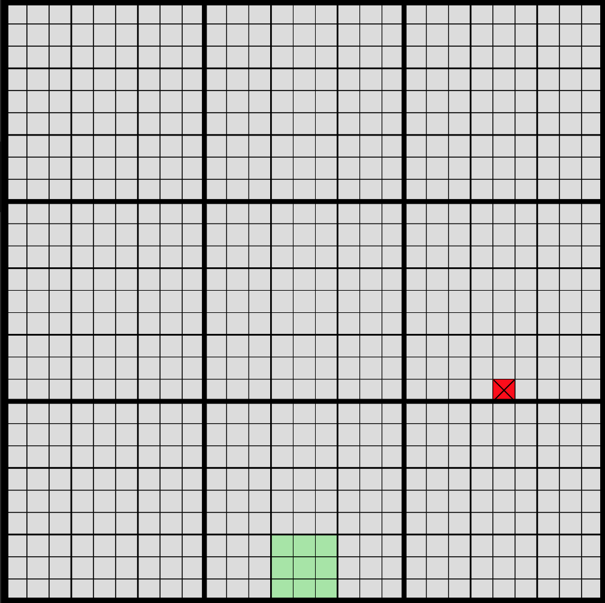
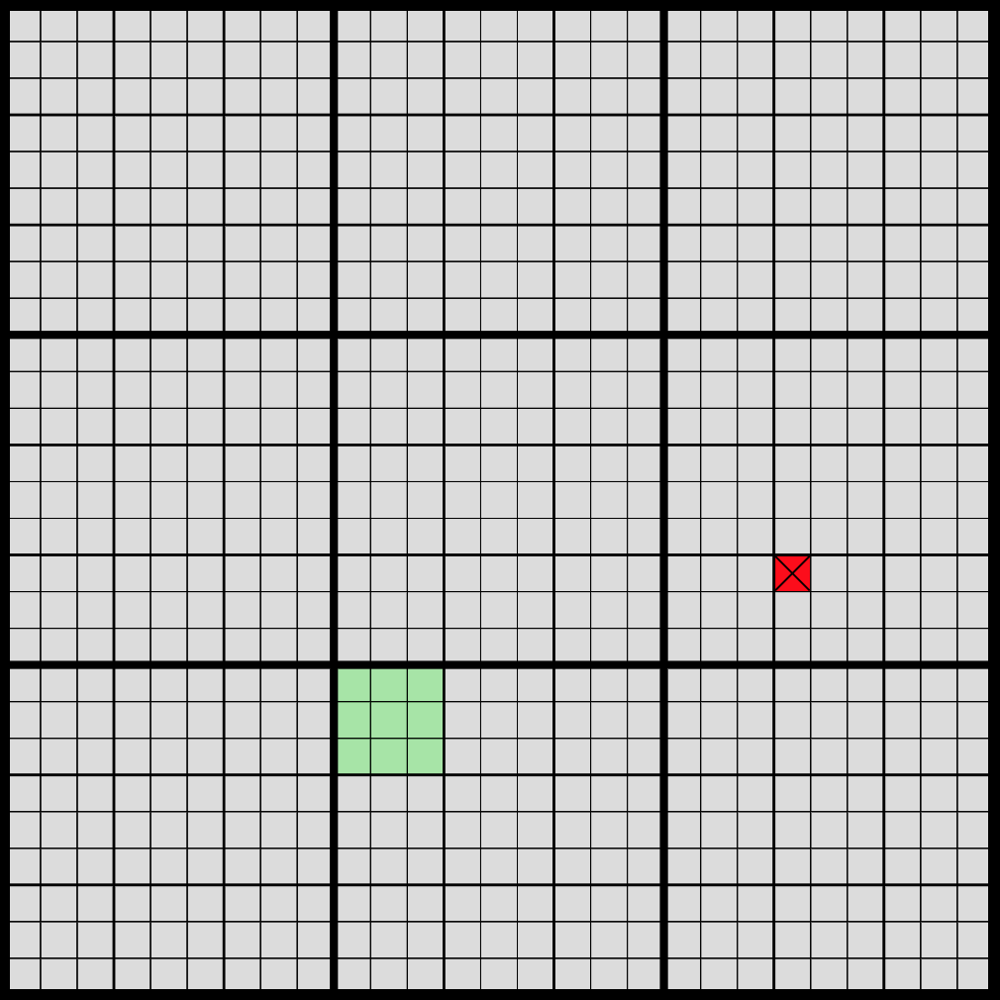
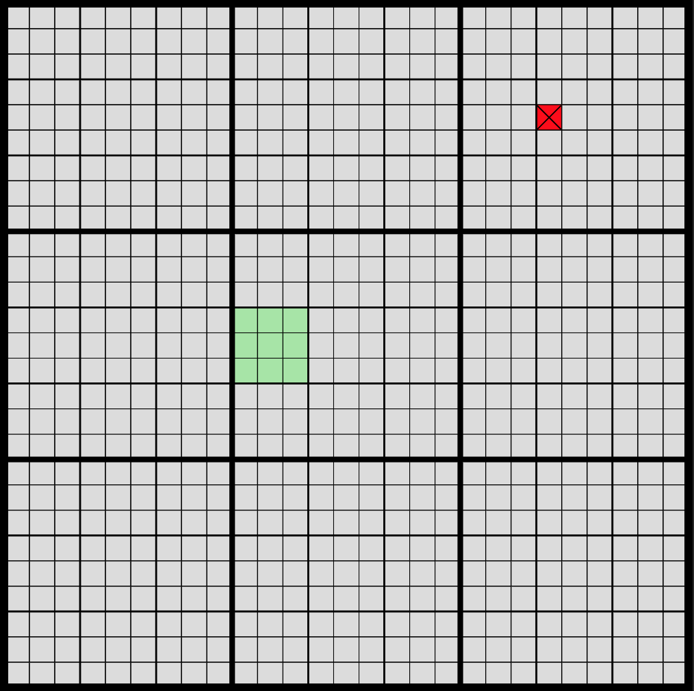
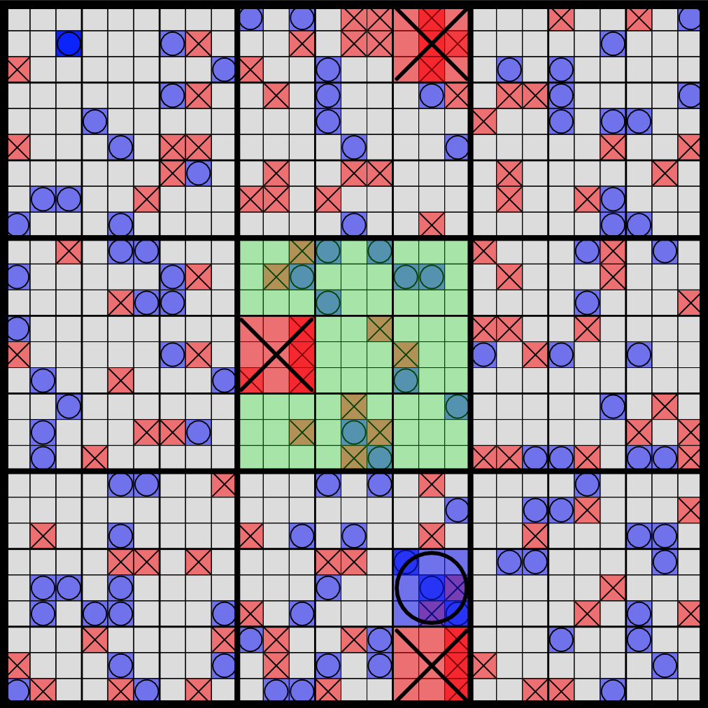
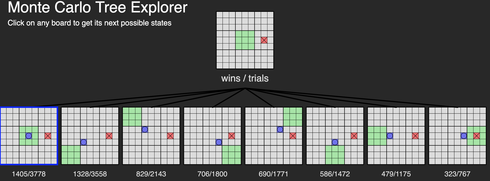

  

# The project 

This project is an enhancement based on the [Ultimate Tic-Tac-Toe](https://en.wikipedia.org/wiki/Ultimate_tic-tac-toe) game which consists of adding a layer to the default tic-tac-toe where each of the 9 cases is a tic-tac-toe itself.

This implementation is recursive and allow for an theorically infinite number of layer. In practice, it becomes too complex for a human after the layer 3 and too slow for a computer after the layer 4.

Play it yourself ! [https://indiana-dev.github.io/n-Ultimate-Tic-Tac-Toe/](https://indiana-dev.github.io/n-Ultimate-Tic-Tac-Toe/)

#### Settings
- **Layers**: Deepness of the recursion. (2-4) Default tic-tac-toe is 1, Ultimate tic-tac-toe is 2
- **Thinking time**: How much time is the AI allowed to think before making a move (0.5-30)
- **Players**: Human (waits for your click) / Random (Random AI) / Monte Carlo (ML Algorithm)
- **Show best move**: Execute the Monte Carlo algorithm for 5 secondes but only show the best move instead of actually playing it
- **Reset Game**: Empty all squares
- **Tree Explorer**: See section "Monte Carlo Tree Search"
- **Highlight last move**: Make the difference between each game state more visible while exploring the tree

## How to play ?

Each small 3 × 3 tic-tac-toe board is referred to as a local board, and the larger 3 × 3 board is referred to as the global board.

The game starts with X playing wherever they want in any of the 81 empty spots. This move "sends" their opponent to its relative location. For example, if X played in the top right square of their local board, then O needs to play next in the local board at the top right of the global board. O can then play in any one of the nine available spots in that local board, each move sending X to a different local board.

If a move is played so that it is to win a local board by the rules of normal tic-tac-toe, then the entire local board is marked as a victory for the player in the global board.

Once a local board is won by a player or it is filled completely, no more moves may be played in that board. If a player is sent to such a board, then that player may play in any other board.

Game play ends when either a player wins the global board or there are no legal moves remaining, in which case the game is a draw.

#### Rules with more than 2 layers of recursion:

The principle is exactly the same, but the next playable zone is a bit harder to predict. For example let's say that it's your turn and that you can play on any of the green squares :

  

Where can you expect the next playable zone to be ? In order to answer this, let's focus on the global board square containing the current playable zone. If you compare this section to the global board, you can instantly see where the next zone should be :

   
   

Now the sub-board that is going to be selected depends on the specific square you clicked on :

   
   
   

Finally, if the next playable zone is already won or doesn't have any empty case, then its parent board will be selected as the playable zone instead.
For example take this move : 

  

If the green square has already been won, then the next playable zone will be updated to this :

  

This process is recursive and stops at the first zone containing at least 1 playable square.

## Monte Carlo Tree Search

The [Monte Carlo Tree Search](https://en.wikipedia.org/wiki/Monte_Carlo_tree_search) is a machine learning algorithm that is based on a principle of selection, expansion, simulation and back-propagation of the nodes in the tree. Each node represent a game state, and the algorithm will select the next node using a formula maintaining some balance between the exploitation of deep variants after moves with high average win rate and the exploration of moves with few simulations.

When a node is selected, the algorithm will run a random simulation starting from the current node's game state and stopping when the game is finished (by either a win or a draw).
The result of the simulation will then be back-propagated to the parent nodes.

This process is iterated as long as the algorithm is allowed to think (by default 500ms in my implementation) and the node with the highest visit count (or the highest simulated node) will be selected as the next move.

You can then explore the generated tree with the option `Tree Explorer` in the settings. The first node is the current state of the board and the child represents the next possible game states. They are sorted from best to worse from left to right. You can click on any node to show its childs and explore the tree deeply.

  

